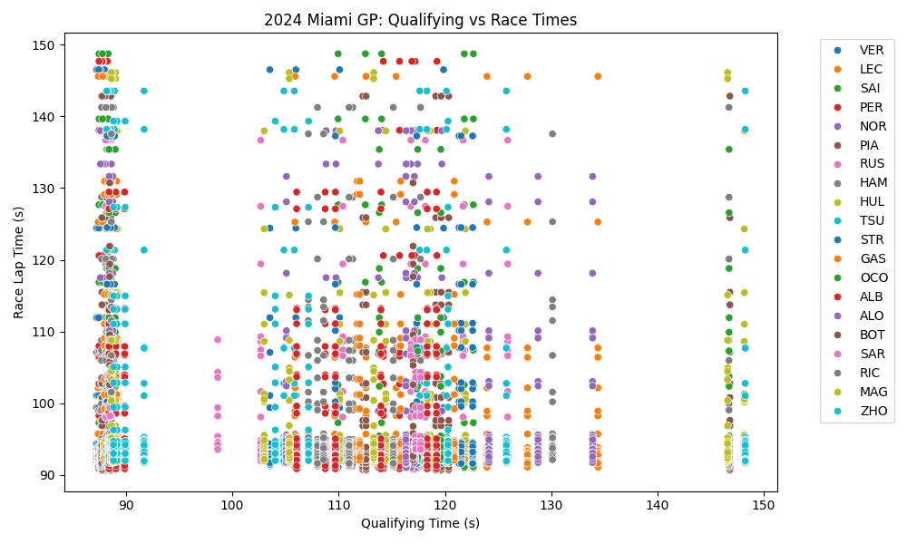
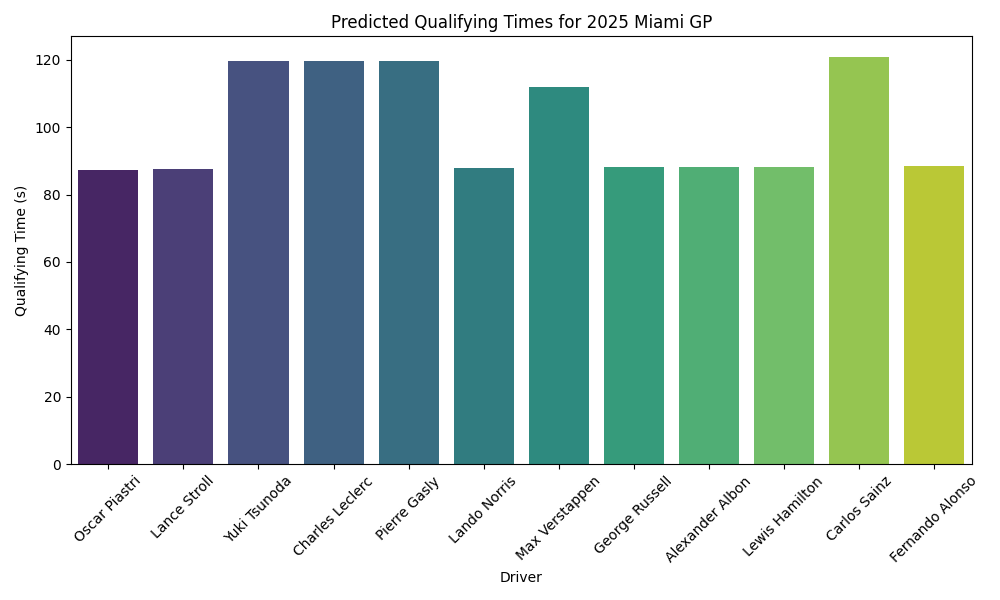

# F1 2025 Race Predictions

## Overview
This repository is dedicated to predicting the **qualifying times** and **race times** for all Formula 1 races in the **2025 season**. As a passionate fan of Formula 1, I aim to use historical data and machine learning models to forecast driver performances for each race. 

Each race will have its own dedicated script for predictions, starting with the **Miami GP 2025 Qualifying Prediction**. As the season progresses, I will add predictions for other races, making this repository a comprehensive hub for F1 2025 race predictions.

---

## Features
- **Race-Specific Predictions**: Each race in the 2025 season will have its own prediction script.
- **Data Extraction**: Uses the FastF1 library to fetch historical data for qualifying and race sessions.
- **Qualifying Time Prediction**: Predicts qualifying times for each race using machine learning models trained on historical data.
- **Race Time Prediction**: Predicts race lap times using predicted qualifying times as input.
- **Driver Rankings**: Ranks drivers based on their predicted race times.
- **Model Evaluation**: Evaluates the performance of the machine learning models using Mean Absolute Error (MAE).

---

## Graphs and Visualizations

### 1. Qualifying vs Race Times for 2024
This scatter plot shows the relationship between qualifying times and race lap times for the 2024 Miami GP. Each point represents a driver's lap time.



---

### 2. Predicted Qualifying Times for 2025
This bar chart displays the predicted qualifying times for the 2025 Miami GP. Each bar represents a driver's predicted qualifying time.



---

### 3. Predicted Race Times for 2025
This bar chart shows the predicted race times for the 2025 Miami GP. Each bar represents a driver's predicted race time.


---

### 4. Qualifying Model Error Distribution
This histogram visualizes the error distribution of the qualifying prediction model, based on the 2024 data. The error is the difference between the actual and predicted qualifying times.


---

## Current Predictions
### Miami GP 2025
The first prediction script in this repository focuses on the **Miami GP 2025**. It predicts:
- **Qualifying Times**: Based on historical qualifying data from the 2024 Miami GP.
- **Race Times**: Based on predicted qualifying times and historical race data.

Future races will follow a similar structure, with separate scripts for each Grand Prix.

---

## Project Workflow
1. **Data Collection**:
   - Historical data for each race is fetched using the FastF1 library.
   - Data includes lap times for both qualifying and race sessions.

2. **Data Preprocessing**:
   - Lap times are converted to seconds for easier numerical processing.
   - Qualifying and race data are merged to create a unified dataset for training.

3. **Model Training**:
   - A **Gradient Boosting Regressor** is trained to predict qualifying times based on historical qualifying data.
   - A second **Gradient Boosting Regressor** is trained to predict race times using qualifying times as input.

4. **Prediction**:
   - The trained models are used to predict qualifying and race times for the upcoming race.
   - Predictions are made for a predefined list of drivers.

5. **Driver Rankings**:
   - Drivers are ranked based on their predicted race times.

6. **Model Evaluation**:
   - The performance of the qualifying prediction model is evaluated using Mean Absolute Error (MAE).

---

## Installation

### Prerequisites
- Python 3.9 or higher
- Virtual environment (recommended)
- Libraries:
  - `fastf1`
  - `pandas`
  - `numpy`
  - `scikit-learn`

### Steps
1. Clone the repository:
   ```bash
   git clone https://github.com/yourusername/F1-2025-Predictions.git
   cd F1-2025-Predictions
   ```

2. Create and activate a virtual environment:
   ```bash
   python3 -m venv .venv
   source .venv/bin/activate  # On macOS/Linux
   .venv\Scripts\activate     # On Windows
   ```

3. Install the required dependencies:
   ```bash
   pip install -r requirements.txt
   ```

4. Run the script for the desired race:
   ```bash
   python3 MiamiPrediction2025.py
   ```

---

## Usage
1. **Run the Script**:
   - Each race will have its own script (e.g., `MiamiPrediction2025.py` for the Miami GP).
   - The script will fetch historical data, train the models, and output the predictions for the selected race.

2. **Output**:
   - Predicted qualifying times for each driver.
   - Predicted race times for each driver.
   - Rankings based on predicted race times.

3. **Example Output**:
   ```
   🏁 Predicted 2025 Miami GP Results 🏁

         Driver           QualifyingTime (s)    PredictedRaceTime (s)
   1     Max Verstappen   78.12                 90.45
   2     Charles Leclerc  78.45                 90.78
   3     Lewis Hamilton   78.67                 91.12
   ...
   ```

---

## File Structure
```
F1-2025-Predictions/
├── MiamiPrediction2025.py   # Script for Miami GP predictions
├── f1_cache/                # Cache directory for FastF1 data
├── requirements.txt         # List of dependencies
├── README.md                # Project documentation
├── qualifying_vs_race_times_2024.png
├── predicted_qualifying_times_2025.png
├── predicted_race_times_2025.png
├── qualifying_model_error_distribution.png
└── (Future scripts for other races will be added here)
```

---

## Models
### Qualifying Prediction Model
- **Algorithm**: Gradient Boosting Regressor
- **Input Features**: Historical qualifying times
- **Target**: Qualifying times for the selected race
- **Evaluation Metric**: Mean Absolute Error (MAE)

### Race Prediction Model
- **Algorithm**: Gradient Boosting Regressor
- **Input Features**: Predicted qualifying times
- **Target**: Race lap times for the selected race
- **Evaluation Metric**: Mean Absolute Error (MAE)

---

## Data Sources
- **FastF1 Library**: Provides historical Formula 1 data, including lap times, driver information, and session details.
- **2024 Season Data**: Used as the primary dataset for training the models.

---

## Limitations
- **Data Availability**: Predictions are based on historical data, which may not fully capture future race conditions (e.g., weather, track changes, car upgrades).
- **Simplified Features**: The models use only lap times as features, without considering other factors like tire strategy, pit stops, or weather conditions.

---

## Future Improvements
- Add scripts for all 2025 races as the season progresses.
- Incorporate additional features such as weather data, tire strategies, and car performance metrics.
- Use data from multiple seasons to improve model generalization.
- Explore advanced machine learning models like neural networks for better predictions.

---

## Acknowledgments
- **FastF1 Library**: For providing easy access to Formula 1 data.
- **Scikit-learn**: For the machine learning tools used in this project.
- **Formula 1 Community**: For inspiring this project as a fan-driven initiative.

---

## License
This project is licensed under the MIT License. See the `LICENSE` file for details.

---

## Contact
If you have any questions or suggestions, feel free to reach out:
- **Name**: Bharat Garsondiya
- **Email**: contact@bharatgarsondiya.me
- **GitHub**: [bharatpatel7](https://github.com/bharatpatel7)
```
